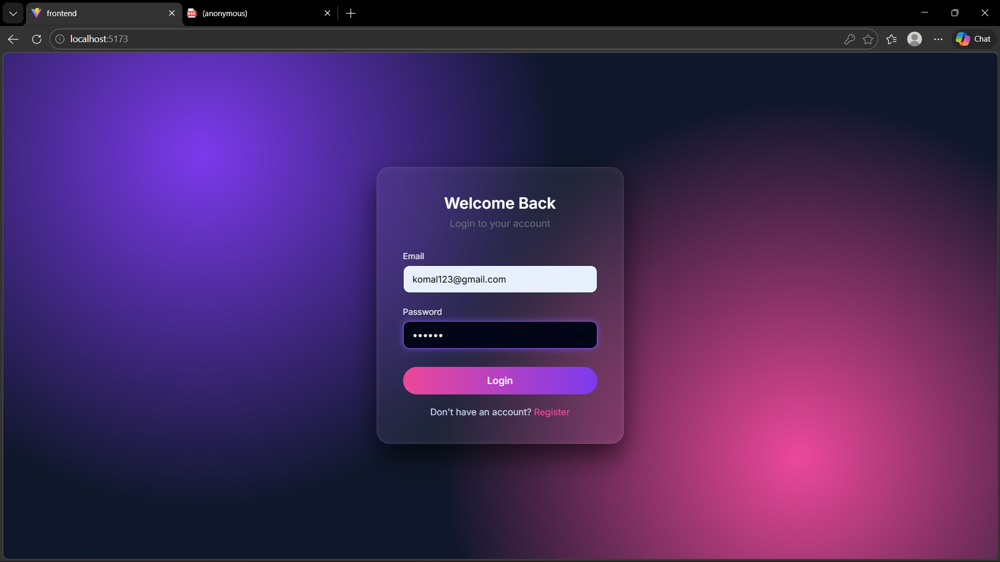
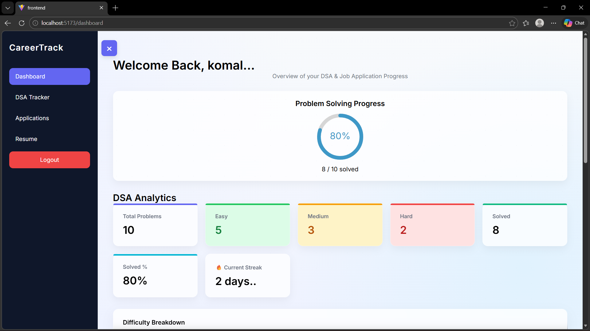
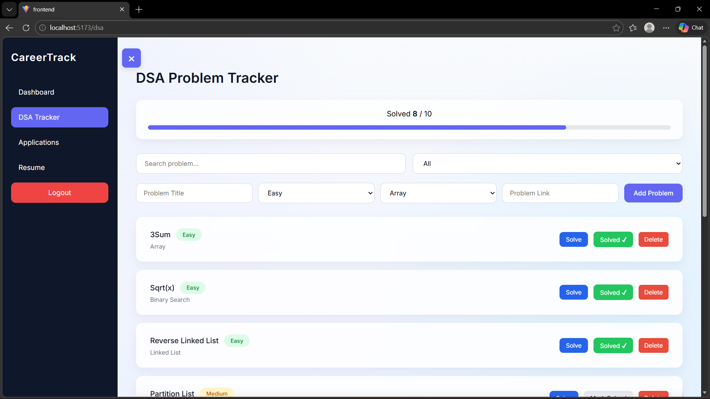
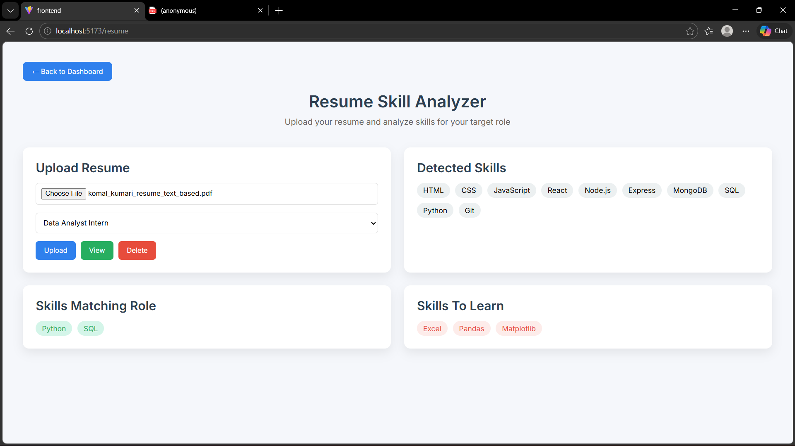

# CareerTrack

CareerTrack is a full-stack web application to help users track their career progress, job applications, and DSA (Data Structures & Algorithms) practice. Users can upload resumes, track applications, and monitor skills for career growth.

## Tech Stack

- **Frontend:** React, Vite, CSS  
- **Backend:** Node.js, Express  
- **Database:** MongoDB  
- **Authentication:** JWT  

## Features

- Secure user authentication (JWT)
- Personal dashboard with career progress
- Resume upload system
- Planned AI-based skill extraction from resume
- DSA progress tracker
- Job application management system

## Folder Structure
CareerTrack/
├── backend/ # Express server & MongoDB connection
├── frontend/ # React application
├── package.json
├── package-lock.json
└── README.md


## screenshots

### Login Upload


### Dashboard


### DSA_TRACKER Upload


### Resume Upload



## Getting Started

### 1. Clone the repository
```bash
git clone https://github.com/Komal12kumari/CareerTrack.git
cd CareerTrack

2. Backend setup
cd backend
npm install
npm start

The backend runs on http://localhost:5000

Make sure your .env contains your MongoDB URI and JWT secret

3. Frontend setup
cd ../frontend
npm install
npm run dev

The frontend runs on http://localhost:5173

Open in browser to use the app

Notes

Do not commit .env or node_modules

Uploaded resumes (backend/uploads/) are ignored in Git

Future Improvements

AI-based resume skill extraction

Analytics charts in dashboard

Deployment on Vercel (frontend) and Render (backend)

Email notifications for applications

Author
Komal Kumari  
B.Tech - Artificial Intelligence & Data Science
Aspiring Full Stack Web Developer